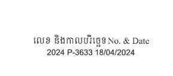
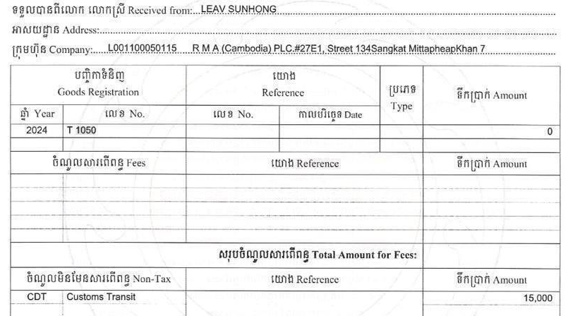
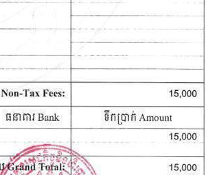

# OCR Processing Report

**Template:** Tax Invoice Template
**Description:** Cambodian Standard Tax Invoice
**Processed:** 2025-02-11 22:34:09

## 1. invoice_header
**Coordinates:** 
```
{'x_start': 0.0, 'x_end': 1.0, 'y_start': 0.0, 'y_end': 0.15}
```

**Extracted Text:**
```
ព្រះរាជាណាចត្រកម្ពុជា
ចិ Kingdom of Cambodia
ន OW សាសនា ព្រះមហាក្សត្រ
អិ Nation Religion King
```

## 2. vendor_info
**Coordinates:** 
```
{'x_start': 0.05, 'x_end': 0.45, 'y_start': 0.15, 'y_end': 0.3}
```

**Extracted Text:**
```
អគ្គនាយកដ្ឋានគយនំងរដ្ឋាភរកម្ពុជា
General Department of Customs and Excise
បង្ហា
ង
PAY?
នាយកដ្ឋាន/ សាខាវការិយាល័យ Department/Branch/Office:
```

## 3. customer_info
**Coordinates:** 
```
{'x_start': 0.63, 'x_end': 0.95, 'y_start': 0.15, 'y_end': 0.25}
```

**Extracted Text:**
```
លេខ និងភាលបរិច្ឆេទ No. & Date
2024 P-3633 18/04/2024
```

## 4. items_table
**Coordinates:** 
```
{'x_start': 0.05, 'x_end': 0.95, 'y_start': 0.3, 'y_end': 0.65}
```

**Extracted Text:**
```
ទនួលបានពីរលាក លោកស្រី Received from:.. BAY. $បស7០៤ឲ...............-------------------------------------------"---------- -------------- ---"«*"-"":--».
អាសយដ្ឋាន /ស៤0#ន::.,...-.---.-----«---.-‹-*"--*"-------*""-"-----------«-- ----- ----" --" "+ "-----"--"--.”«--". *""«”"«-=-«""" "--«" """""-""-"-.----
ក្រូមហ៊ុន Company.......L001300050115.... RMA (Cambodia) PLO.#27E4, Street 134Sanakat Mittaphearkhan Zsa
បញ្ចិកានិនិញ យោង
Gonds Registration Reference ប្រទ អ៊ីតប្រាក់ Amount
= 1
ឆ្នាំ Year លេខ No. លេខ No. ve

504 7107 ញន កក
a a

ចិណូលសាវពើពន្ធ Fees នឺតប្រាក់ Amoum

0 ទ្ធ t

សរុបចំណូលលារពើពន្ឋ Total Amount for Fees: fF

ចំណូលមិនមែនសារពើពន្ធ Non-Tax យោង Reference ទឹកប្រាក់ Amount
CDT; Customs Transit _ 48,000
```

## 5. payment_summary
**Coordinates:** 
```
{'x_start': 0.6, 'x_end': 0.95, 'y_start': 0.65, 'y_end': 0.85}
```

**Extracted Text:**
```
ធនាគារ Bank ទឹកប្រាក់ Amount
15,000
225
AAR Pare
easing Fafa de NS 48,000
```

